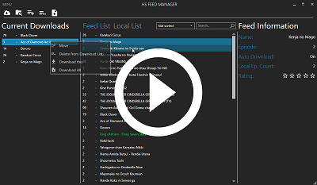
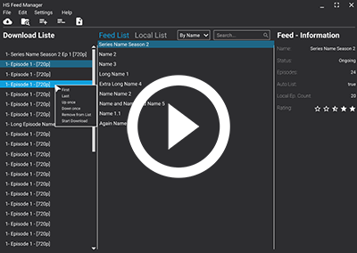

# HS-Feed-Suite
Download RSS Feeds, save them in multiple locations, rate them and download youre favourite shows automatically.
Manage youre shows in a nice and easy way. Start to play them via the app and never use the slow explorer.exe anymore.
If you have hundreds of local files you will need to manage them.

## Libraries
  

  
  
  

## UI Promo Video Beta 0.1.0.0
A small video about the usage and design of the current version. The first release is coming soon.

Blog Post Part 2 =>
https://www.die-technik-und-ich.at/?p=552

## Design and Wireframe Prototype

In this link you can view the basic design of the app, which was made beforehand.  
You can also play with the Wireframe capabilities. (Press the play button in the top right corner!)

https://www.figma.com/file/Av6R3v9YgAGMxV75KM2KOU/HS-Feed-Manager?node-id=0%3A1

## Time Laps Video Design Creation

A small time laps of the design creation.

Blog Post Part 1 =>
https://www.die-technik-und-ich.at/?p=543  

- - - -
## Short Description of the used libraries and techniques
This app shows the basic usage of the following components:

1. [Mahapps Library](https://github.com/MahApps/MahApps.Metro) (Hamburger Menu, Button, SplitButton, DataGrid, ScrollViewer, Checkbox, Login Window, PasswordBox)
2. [Mahapps IconPacks](https://github.com/MahApps/MahApps.Metro.IconPacks) (Material Design Icons)
3. MVVM Design Pattern with Mediator, RelayCommand
4. SQLite Database
5. Microsoft.EntityFramework.Core.Sqlite (Code First)
6. LINQ
7. C# WPF
